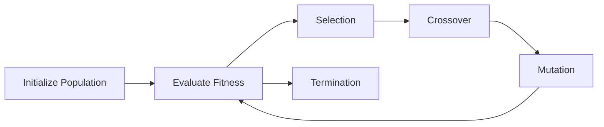

```mermaid
graph LR
    A[Initialize Population]
    B[Evaluate Fitness]
    C[Selection]
    D[Crossover]
    E[Mutation]
    F[Termination]

    A --> B
    B --> C
    C --> D
    D --> E
    E --> B
    B --> F
```